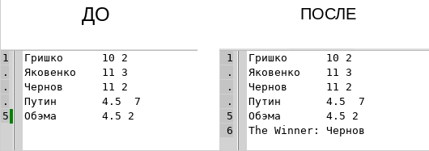
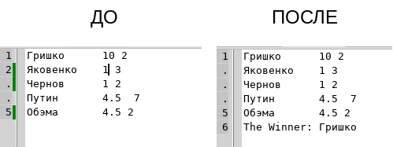
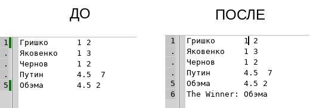

# Задача № 36
    В текстовом файле содержатся результаты по прыжкам в
    высоту, которые представлены в виде набора строк, содержащих
    фамилию спортсмена, результат и полное количество попыток.
    Записать в исходный файл фамилию победителя. При равенстве
    результатов победителем считается спортсмен, имеющий меньшее
    количество попыток.

## Пример работы прораммы:
##### Победитель Чернов, так как у Яковенко было попыток больше

##### Победитель Гришко, так как у него лучший результат

##### Пример с вещественными числами, Обэма выйграл, так как у Путина было слишком много попыток

